# 📡 condu**IT** SMS Gateway - Official Releases

Welcome to the official distribution repository for the **conduIT SMS Gateway** edge node. This repository hosts signed production artifacts, changelogs, and security checksums for the Conduit Android platform.

## 🚀 Overview

The **conduIT Edge Node** is an enterprise-grade Android application designed for high-performance SMS routing. It acts as a bridge between the Conduit Cloud API and the mobile telephony stack, providing resilient, carrier-safe message delivery with bank-grade security.

### 🛠️ Key Capabilities
- **Per-SIM TPS Enforcement**: Precision rate limiting (1 TPS default) to ensure carrier compliance and prevent SIM blocking.
- **Intelligent SIM Health**: Automatic tiered quarantine and reputation scoring of local SIM slots.
- **Layered Security**: AES-256-GCM encrypted FCM control channel and HMAC-SHA256 payload integrity.
- **Durable Lifecycle**: Robust "Push-to-Queue" architecture with atomic leasing and exponential backoff recovery.
- **Immutable Governance**: Hash-chained local audit logging with server-side anchoring.

---

## � Message Life Cycle

The following diagram illustrates the secure, multi-stage flow of a message through the Conduit ecosystem.

```mermaid
%%{init: {'theme': 'neutral', 'themeVariables': { 'primaryColor': '#007bff', 'edgeLabelBackground':'transparent' }}}%%
graph TD
    subgraph ST1 ["🛰️ Stage 1: Ingress"]
        REQ["☁️ Conduit Cloud API"] -- "HMAC Signing" --> FCM["📡 Google FCM"]
        FCM -- "Encrypted Push" --> APP["📱 conduIT Node"]
    end

    subgraph ST2 ["⚙️ Stage 2: Processing"]
        APP -- "AES-GCM Decrypt" --> SEC["🛡️ Security Layer"]
        SEC -- "Durable Lock" --> DB["🗄️ Local SQLCipher"]
        DB -- "Lease Start" --> RNG["🚀 Routing Engine"]
    end

    subgraph ST3 ["📶 Stage 3: Handoff"]
        RNG -- "TPS Enforcer" --> LIM["⛓️ Rate Limiter"]
        LIM -- "SIM Health Check" --> RAD["📶 Radio (Hardware)"]
        RAD -- "DLR Confirmation" --> SYNC["✅ Cloud Sync"]
        SYNC -. "Finalize Status" .-> REQ
    end

    %% Professional Styling
    style ST1 fill:none,stroke:#007bff,stroke-width:2px,stroke-dasharray: 5 5
    style ST2 fill:none,stroke:#6c757d,stroke-width:2px,stroke-dasharray: 5 5
    style ST3 fill:none,stroke:#28a745,stroke-width:2px,stroke-dasharray: 5 5

    classDef active fill:#007bff,color:#fff,stroke:#0056b3,stroke-width:1px
    class REQ,FCM,APP,SEC,DB,RNG,LIM,RAD,SYNC active

    %% Clickable References
    click REQ "https://github.com/Conduit-Ke/conduit" "Technical Documentation"
    click APP "https://github.com/Conduit-Ke/conduit-releases" "Release Artifacts"
```



---

## �📦 Installation

To deploy a new node, follow these steps:

1. **Download**: Navigate to the [Latest Release](https://github.com/Conduit-Ke/conduit-releases/releases/latest) and download `conduIT.apk`.
2. **Transfer**: Move the APK to your Android device (Android 8.0+ / API 26+).
3. **Install**: Enable "Install from Unknown Sources" and run the APK.
4. **Provision**: Log in using your Conduit organization credentials and grant the required permissions (SMS, Phone State, Battery Optimization).

---

## 🛡️ Security Verification

Every release includes a `conduIT.apk.sha256` checksum file. We recommend verifying the integrity of your download:

```bash
# Verify the checksum on Linux/macOS
sha256sum -c conduIT.apk.sha256
```

---

## 📜 Versioning

We follow [Semantic Versioning](https://semver.org/). 
- **Major**: Architectural changes or significant feature milestones.
- **Minor**: New capabilities (e.g., new monitoring hooks, improved UI).
- **Patch**: Security updates, bug fixes, and performance optimizations.

---

## 🏗️ Technical Support

The source code and development tracker are maintained in our private core repository. For issues related to node deployment or carrier-specific routing problems, please contact your organization administrator or refer to the [Conduit Documentation](https://github.com/Conduit-Ke/conduit).

---
© 2026 Conduit. All rights reserved.
